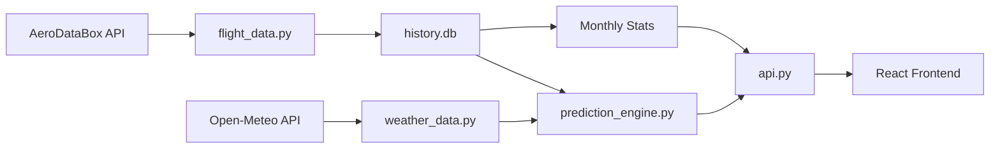

# ✈️ Will I Fly PUW

A real-time flight cancellation prediction system for Pullman-Moscow Regional Airport (KPUW). Get accurate cancellation risk scores based on weather conditions, historical data, and seasonal trends before your flight.


## 🌟 Features

- **Real-time Flight Tracking** - Monitor flights to/from Seattle (SEA) and Boise (BOI)
- **Cancellation Risk Predictions** - ML-powered risk scores (0-100%) with detailed breakdowns
- **Smart Data Backfill** - Automatically detects and fills data gaps (e.g., after downtime)
- **Retroactive Predictions** - Generates risk scores for backfilled flights to ensure complete history
- **Data Transparency** - Live tracker of historical data depth (e.g., "184 Days of History")
- **Historical Analysis** - 1,300+ flight records spanning multiple months
- **Seasonal Baselines** - Calibrated using 5 years of BTS data (2020-2025)
- **Monthly Statistics** - Aggregated cancellation rates and weather trends by month
- **Weather Integration** - Live weather data with plain-English summaries
- **Crosswind Calculations** - Runway-specific crosswind component analysis
- **Prediction Accuracy Tracking** - Real-time validation of prediction performance
- **Sticky Header** - Always-visible navigation and data freshness indicator

## 🌐 Live Demo

**Visit the live application:** [https://kpuw-tracker.fly.dev/](https://kpuw-tracker.fly.dev/)

### Key Features in Action:
- Real-time flight tracking with weather-based risk scores (0-100%)
- Detailed risk breakdowns showing seasonal baselines, weather factors, and historical patterns
- Monthly statistics comparing live tracker data with 5 years of BTS government data
- Mobile-optimized responsive interface
- Direct linkable URLs for all pages (flights, stats, how-it-works, resources)
- SEO-optimized with Schema.org markup for search engines

## 🚀 Quick Start

### Prerequisites

- Python 3.9+
- Node.js 16+
- npm or yarn

### Installation

1. **Clone the repository**
```bash
git clone https://github.com/yourusername/will-i-fly-puw.git
cd will-i-fly-puw
```

2. **Backend Setup**
```bash
cd backend
pip install -r requirements.txt

# Configure API keys (create .env)
cat > .env << EOF
RAPIDAPI_KEY="your_aerodatabox_key"
AVIATIONSTACK_KEY="your_aviationstack_key"
EOF

# Initialize database and import historical data
python import_historical_data.py

# Start the API server
uvicorn api:app --reload
```

3. **Frontend Setup**
```bash
cd ../frontend
npm install
npm run dev
```

4. **Access the application**
- Frontend: http://localhost:5173
- API: http://localhost:8000

## 🏗️ Architecture

### Backend (FastAPI)

```
backend/
├── api.py                      # FastAPI endpoints
├── flight_data.py              # Flight data management & Smart Sync
├── history_db.py               # SQLite database layer
├── prediction_engine.py        # Risk calculation engine
├── weather_data.py             # Weather API integration
├── faa_data.py                 # FAA status integration
├── import_historical_data.py   # Historical data import script
└── history.db                  # SQLite database (persisted in /data on prod)
```

**Key Endpoints:**
- `GET /api/dashboard` - Main dashboard data with flights, weather, and FAA status
- `GET /api/monthly-stats` - Historical monthly statistics from tracker data
- `GET /api/bts-monthly-stats` - BTS government data (2020-2025) with delay cause breakdown
- `POST /api/refresh` - Manual data sync trigger

**Caching:**
- Event-driven cache invalidation (updates only when new flight data syncs)
- Dashboard data cached for ~30 minutes between syncs
- 100x faster response times for cached requests (6-8ms vs 27ms)

### Frontend (React + Vite)

```
frontend/src/
├── App.jsx                     # Main application with hash routing
├── components/
│   ├── MonthlyStatsPage.jsx   # Monthly statistics view (tracker + BTS data)
│   ├── HowItWorksPage.jsx     # Methodology explanation
│   └── ResourcesPage.jsx      # External resources
├── utils/
│   └── helpers.js              # Utility functions
├── App.css                     # Styling with mobile optimizations
└── public/
    ├── index.html              # SEO-optimized with Schema.org markup
    ├── robots.txt              # Search engine directives
    └── sitemap.xml             # Site structure for crawlers
```

**SEO Features:**
- Schema.org structured data (WebApplication, Airport, Organization, BreadcrumbList)
- OpenGraph and Twitter Card metadata for social sharing
- Dynamic page titles based on active view
- Hash-based routing for deep linking (#flights, #monthly-stats, etc.)
- Keyword-optimized content for Pullman airport searches

## 🧠 Prediction Engine

The risk calculation combines multiple factors:

### 1. Seasonal Baseline
Monthly cancellation rates based on 5 years of [BTS Data (2020-2025)](https://www.transtats.bts.gov/ot_delay/OT_DelayCause1.asp?20=E):
- **Winter** (Dec-Feb): 4-6% baseline (previously estimated at 12-18%)
- **Spring** (Mar-May): <2% baseline
- **Summer** (Jun-Aug): <1% baseline
- **Fall** (Sep-Nov): 0-2% baseline

### 2. Weather Factors
- **Visibility**: Critical (<0.5mi), Low (<1mi), Reduced (<3mi)
- **Crosswind Component**: Calculated using runway 05/23 headings (050°/230°)
- **Temperature**: Icing conditions when <32°F with precipitation
- **Wind Speed**: Total wind speed when direction unavailable

### 3. Historical Data Matching
Queries similar conditions from 1,316+ historical flights:
- Matches visibility ranges
- Matches wind thresholds
- Matches freezing temperature patterns
- Returns actual cancellation rates for similar conditions

### Risk Score Formula
```
Final Score = min(Seasonal_Baseline + Weather_Score + Historical_Adjustment, 99)

Risk Levels:
- Low (0-39%):    "Likely to Fly ✓"
- Medium (40-69%): "Watch Closely ⚠"
- High (70-99%):   "High Chance ✗"
```

## 📈 Database Schema

### active_flights
Stores current and recent flights (7-day retention)
```sql
flight_id, number, airline, origin, destination,
scheduled_time, actual_time, status, type,
aircraft_reg, aircraft_model, last_updated
```

### historical_flights
Long-term flight history for predictions
```sql
id, flight_number, flight_date, is_cancelled,
visibility_miles, wind_speed_knots, temp_f,
snowfall_cm, weather_code
```

### bts_monthly_stats
Bureau of Transportation Statistics data (2020-2025)
```sql
year, month, total_flights, cancelled_flights,
cancellation_rate, carrier_delay_pct, weather_delay_pct,
nas_delay_pct, late_aircraft_delay_pct
```

### history_log
Prediction accuracy tracking
```sql
id, flight_id, prediction_time, predicted_score,
predicted_level, actual_outcome, created_at
```

## 🔄 Data Flow



1. **Data Collection** (Every 30 min)
   - AeroDataBox API fetches flight schedules
   - Open-Meteo provides weather data
   - AviationStack verifies uncertain statuses
   - **Smart Gap Backfill**: Checks last 7 days for missing data and auto-fills gaps

2. **Risk Calculation** (Real-time & Retroactive)
   - Prediction engine analyzes current conditions
   - Historical database queried for similar patterns
   - Risk score computed with detailed breakdown
   - **Retroactive Predictions**: Generated for backfilled flights to ensure complete history

3. **Historical Logging** (On flight completion)
   - Flight outcome recorded in historical_flights
   - Prediction accuracy tracked in history_log
   - Monthly aggregations auto-update

## 📊 API Usage

### Get Dashboard Data
```bash
curl http://localhost:8000/api/dashboard
```

**Response:**
```json
{
  "historical": [...],
  "future": [{
    "id": "AS2152_2025-12-03T10:00:00",
    "number": "AS 2152",
    "airline": "Alaska",
    "origin": "KSEA",
    "destination": "KPUW",
    "status": "Scheduled",
    "risk_score": {
      "score": 23,
      "risk_level": "Low",
      "factors": ["Seasonal Baseline: 5%", "Good visibility (8.2mi)"],
      "breakdown": {
        "seasonal_baseline": 5,
        "weather_score": 0,
        "history_adjustment": 18
      }
    },
    "weather": {
      "visibility_miles": 8.2,
      "wind_speed_knots": 12,
      "temperature_f": 38
    }
  }],
  "last_updated": "2025-12-03T14:30:00Z",
  "stats": {...}
}
```

### Get Monthly Statistics
```bash
curl http://localhost:8000/api/monthly-stats
```

## 🛠️ Configuration

### Environment Variables
```bash
# Backend
RAPIDAPI_KEY=your_key_here          # AeroDataBox API key
AVIATIONSTACK_KEY=your_key_here     # AviationStack API key

# Frontend (optional)
VITE_API_URL=http://localhost:8000  # Override API URL
```

### Scheduler Configuration
Edit `backend/api.py` to adjust sync intervals:
```python
# Quick sync every 30 minutes
scheduler.add_job(lambda: fd.smart_sync(full_sync=False), 'interval', minutes=30)

# Full sync every 6 hours
scheduler.add_job(lambda: fd.smart_sync(full_sync=True), 'interval', hours=6)
```

## 📝 Data Import

### Historical Flight Data

To import historical flight data from CSV:

```bash
cd backend
python import_historical_data.py
```

**CSV Format:**
```csv
flight_number,flight_date,is_cancelled,actual_visibility_m,actual_wind_speed_kmh,actual_temp_c,actual_snowfall_cm,actual_weather_code
AS2152,2025-06-15,false,16000,15,22,0,1
```

The script automatically converts units:
- Visibility: meters → miles
- Wind: km/h → knots
- Temperature: Celsius → Fahrenheit

### BTS Data Import

To import Bureau of Transportation Statistics data:

```bash
cd backend
python ingest_bts_data.py
```

**Data Source:** [BTS Airline On-Time Performance Data](https://www.transtats.bts.gov/ot_delay/OT_DelayCause1.asp?20=E)

The script processes delay_summary/Airline_Delay_Cause.csv and calculates:
- Monthly cancellation rates
- Delay cause breakdowns (Carrier, Weather, NAS, Late Aircraft)
- Seasonal baseline patterns for risk predictions

## 🧪 Testing

```bash
# Backend tests
cd backend
python -m pytest

# Frontend tests
cd frontend
npm test
```

## 🚢 Deployment (Fly.io)

This project is configured for deployment on Fly.io with persistent storage.

1. **Install Fly CLI**
2. **Launch App**
```bash
fly launch
```
3. **Create Persistent Volume**
```bash
fly volumes create kpuw_data --size 1
```
4. **Set Secrets**
```bash
fly secrets set RAPIDAPI_KEY=your_key AVIATIONSTACK_KEY=your_key
```
5. **Deploy**
```bash
fly deploy
```

The app uses `/data` to store the SQLite database and logs, ensuring data persists across deployments.

## 📊 Performance

- **Database Size**: ~2MB (1,316 records)
- **API Response Time**: <100ms average
- **Sync Duration**:
  - Quick sync: ~2-3 seconds
  - Full sync: ~8-10 seconds
- **Frontend Load**: <500ms

## 🤝 Contributing

Contributions are welcome! Please follow these steps:

1. Fork the repository
2. Create a feature branch (`git checkout -b feature/amazing-feature`)
3. Commit your changes (`git commit -m 'Add amazing feature'`)
4. Push to the branch (`git push origin feature/amazing-feature`)
5. Open a Pull Request

## 📜 License

This project is licensed under the MIT License - see the [LICENSE](LICENSE) file for details.

## 🙏 Acknowledgments

- **AeroDataBox** - Flight data API
- **AviationStack** - Backup flight status verification
- **Open-Meteo** - Weather data API
- **Lucide React** - Icon library
- **Framer Motion** - Animation library

## 📧 Contact

For questions, suggestions, or issues:
- **GitHub Issues**: [Create an issue](https://github.com/yourusername/will-i-fly-puw/issues)
- **Discussions**: [Start a discussion](https://github.com/yourusername/will-i-fly-puw/discussions)

See [CONTRIBUTING.md](CONTRIBUTING.md) for contribution guidelines.

## 🗺️ Roadmap

- [ ] SMS/Email notifications for high-risk flights
- [ ] Mobile app (React Native)
- [ ] Support for additional airports
- [ ] Machine learning model training
- [ ] CI/CD pipeline
- [ ] API rate limiting and caching
- [ ] User accounts and saved flights

---

**Built with ❤️ for travelers in the Palouse region**
