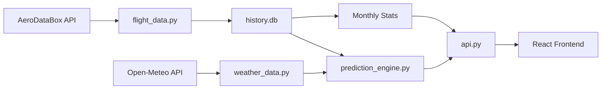

# ✈️ Will I Fly PUW

A (near)real-time flight cancellation prediction system for Pullman-Moscow Regional Airport (KPUW). Get (possibly semi-)accurate cancellation risk scores based on weather conditions, historical data, and seasonal trends before your flight.


## 🌟 Features

- **Real-time Flight Tracking** - Monitor flights to/from Seattle (SEA) and Boise (BOI)
- **Multi-Airport Weather Analysis** - Fetches and analyzes weather from PUW, SEA, and BOI simultaneously
- **Cancellation Risk Predictions** - Pattern-matching risk scores (0-100%) with detailed breakdowns
- **Smart Data Backfill** - Automatically detects and fills data gaps (e.g., after downtime)
- **Retroactive Predictions** - Generates risk scores for backfilled flights to ensure complete history
- **Data Transparency** - Live tracker of historical data depth (e.g., "184 Days of History")
- **Historical Analysis** - 1,300+ flight records with multi-airport weather patterns
- **Seasonal Baselines** - Calibrated using 5 years of BTS data (2020-2025)
- **Monthly Statistics** - Aggregated cancellation rates and weather trends by month
- **Weather Integration** - Live 10-day forecasts with hourly granularity for all three airports
- **Runway-Specific Crosswind Calculations** - Calculated for PUW (05/23), SEA (16L/34R), and BOI (10L/28R)
- **Origin/Destination Weather Weighting** - Prioritizes weather at departure/arrival airports based on flight type
- **Prediction Accuracy Tracking** - Real-time validation of prediction performance
- **Sticky Header** - Always-visible navigation and data freshness indicator

## 🌐 Live Demo

**Visit the live application:** [https://williflypuw.com/](https://williflypuw.com/)

## Screenshot


### Key Features in Action:
- Real-time flight tracking with weather-based risk scores (0-100%)
- Detailed risk breakdowns showing seasonal baselines, weather factors, and historical patterns
- Monthly statistics comparing live tracker data with 5 years of BTS government data
- Mobile-optimized responsive interface
- Direct linkable URLs for all pages (flights, stats, how-it-works, resources)
- SEO-optimized with Schema.org markup for search engines

## 🚀 Quick Start

### Prerequisites

- Python 3.9+
- Node.js 16+
- npm or yarn

### Installation

1. **Clone the repository**
```bash
git clone https://github.com/andrewhoehn/will-i-fly-puw.git
cd will-i-fly-puw
```

2. **Backend Setup**
```bash
cd backend
pip install -r requirements.txt

# Configure API keys (create .env)
cat > .env << EOF
RAPIDAPI_KEY="your_aerodatabox_key"
AVIATIONSTACK_KEY="your_aviationstack_key"
EOF

# Initialize database and import historical data
python import_historical_data.py

# Start the API server
uvicorn api:app --reload
```

3. **Frontend Setup**
```bash
cd ../frontend
npm install
npm run dev
```

4. **Access the application**
- Frontend: http://localhost:5173
- API: http://localhost:8000

## 🏗️ Architecture

### Backend (FastAPI)

```
backend/
├── api.py                      # FastAPI endpoints
├── flight_data.py              # Flight data management & Smart Sync
├── history_db.py               # SQLite database layer
├── prediction_engine.py        # Risk calculation engine
├── weather_data.py             # Weather API integration
├── faa_data.py                 # FAA status integration
├── import_historical_data.py   # Historical data import script
└── history.db                  # SQLite database (persisted in /data on prod)
```

**Key Endpoints:**
- `GET /api/dashboard` - Main dashboard data with flights, weather, and FAA status
- `GET /api/monthly-stats` - Historical monthly statistics from tracker data
- `GET /api/bts-monthly-stats` - BTS government data (2020-2025) with delay cause breakdown
- `POST /api/refresh` - Manual data sync trigger

**Caching:**
- Event-driven cache invalidation (updates only when new flight data syncs)
- Dashboard data cached for ~30 minutes between syncs
- 100x faster response times for cached requests (6-8ms vs 27ms)

### Frontend (React + Vite)

```
frontend/src/
├── App.jsx                     # Main application with hash routing
├── components/
│   ├── MonthlyStatsPage.jsx   # Monthly statistics view (tracker + BTS data)
│   ├── HowItWorksPage.jsx     # Methodology explanation
│   └── ResourcesPage.jsx      # External resources
├── utils/
│   └── helpers.js              # Utility functions
├── App.css                     # Styling with mobile optimizations
└── public/
    ├── index.html              # SEO-optimized with Schema.org markup
    ├── robots.txt              # Search engine directives
    └── sitemap.xml             # Site structure for crawlers
```

**SEO Features:**
- Schema.org structured data (WebApplication, Airport, Organization, BreadcrumbList)
- OpenGraph and Twitter Card metadata for social sharing
- Dynamic page titles based on active view
- Hash-based routing for deep linking (#flights, #monthly-stats, etc.)
- Keyword-optimized content for Pullman airport searches

## 🧠 Prediction Engine

The risk calculation combines multiple factors across **three airports** (PUW, SEA, BOI):

### 1. Seasonal Baseline
Monthly cancellation rates based on 5 years of [BTS Data (2020-2025)](https://www.transtats.bts.gov/ot_delay/OT_DelayCause1.asp?20=E):
- **Winter** (Dec-Feb): 4-6% baseline (previously estimated at 12-18%)
- **Spring** (Mar-May): <2% baseline
- **Summer** (Jun-Aug): <1% baseline
- **Fall** (Sep-Nov): 0-2% baseline

### 2. Comprehensive Multi-Airport Weather Analysis
The system uses a **hybrid weather approach** combining actual observations with forecasts:

**Data Sources:**
- **Current Conditions**: NOAA Aviation Weather METAR (actual observations from airport weather stations)
- **Forecasts**: Open-Meteo API (model-based forecasts for 10-day outlook)

This hybrid approach ensures current flight conditions use real observed data (e.g., actual 1.5mi visibility) instead of model forecasts (which might incorrectly show 24mi), while maintaining 10-day forecast capability.

The system collects **13 weather parameters** from three airports in parallel:

**Complete Weather Data per Airport:**
- **Visibility** (miles) - Critical for VFR/IFR operations
- **Wind Speed** (knots) - Sustained winds
- **Wind Gusts** (knots) - **Prioritized over sustained winds** for takeoff/landing safety
- **Wind Direction** (degrees) - Used for runway-specific crosswind calculations
- **Temperature** (°F) - Icing and density altitude risk
- **Precipitation** (inches) - Active rain/snow amount
- **Snow Depth** (inches) - Runway contamination assessment
- **Cloud Cover** (%) - VFR ceiling requirements
- **Atmospheric Pressure** (millibars) - Altimeter settings
- **Humidity** (%) - Icing/fog risk assessment
- **Weather Conditions** (text) - Human-readable description
- **Weather Code** (WMO) - Standardized meteorological code

**Advanced Scoring Logic:**
- **Visibility**: Critical (<0.5mi = +60 pts), Low (<1mi = +40 pts), Reduced (<3mi = +15 pts)
- **Crosswind Component** (runway-specific):
  - PUW: Runway 05/23 (050°/230°)
  - SEA: Runways 16L/34R, 16C/34C, 16R/34L (160°/340°, 170°/350°)
  - BOI: Runways 10L/28R, 10R/28L (100°/280°, 120°/300°)
  - Uses **wind gusts** preferentially for calculations
  - >25kn crosswind: +50 pts, >15kn: +30 pts, >10kn: +10 pts
- **Snow Depth**: >6": +40 pts (major contamination), >3": +25 pts, >1": +15 pts
- **Active Precipitation**:
  - Freezing (temp <32°F): Heavy (>0.3"): +30 pts, Moderate (>0.1"): +20 pts
  - Rain: Heavy (>0.5"): +15 pts, Moderate (>0.1"): +8 pts
- **IFR Conditions**: Cloud cover >90% + visibility <5mi: +10 pts
- **Icing Risk**: Temp <32°F + Humidity >80% + Precipitation: +20 pts

**Weather Weighting:**
- **PUW Weather**: Always scored at 100% (affects all flights)
- **Origin Airport Weather**: Weighted at 70% for arrivals (delays inbound aircraft)
- **Destination Airport Weather**: Weighted at 60% for departures (can close destination)

Example: For a SEA→PUW arrival during Seattle fog with snow, the system scores Seattle's low visibility (0.8mi) + snow depth (4.2") at 70% weight because the aircraft can't depart.

### 3. Comprehensive Multi-Airport Historical Pattern Matching
The system performs sophisticated pattern matching using **all comprehensive weather fields** from 1,172+ historical flights:

**Pattern Matching Logic:**
- **Wind Matching**: Checks **wind gusts** OR sustained winds (±5 knots tolerance)
- **Snow Depth Matching**: ±2 inches tolerance for similar runway contamination
- **Precipitation Matching**: ±0.1 inches tolerance for freezing precip events
- **Visibility Matching**: ±0.5 miles tolerance for low-vis operations
- **Multi-Airport Correlation**: Matches conditions at PUW AND origin/destination simultaneously

**Independent Historical Signals:**
1. **PUW Historical Match**: Finds flights with similar PUW conditions (requires ≥10 matches)
2. **Origin/Dest Historical Match**: Finds flights with similar remote airport conditions (requires ≥5 matches)

These signals are **averaged together** and blended 50/50 with the weather-based score.

**Real-World Examples Captured:**
- "What happened when both PUW and Seattle had snow on the ground?"
- "When Seattle had 25kn gusts AND PUW had low visibility, what was the cancellation rate?"
- "When Boise had freezing precipitation, how often did departures cancel?"

**Data Source:** Historical weather backfilled using Visual Crossing API ($0.23 total cost). Ongoing data uses free Open-Meteo API.

### Risk Score Formula
```
PUW_Score = visibility_penalty + crosswind_penalty + icing_penalty + wind_penalty

Origin_Score = (origin_weather_score × 0.7)  // for arrivals only
Dest_Score = (dest_weather_score × 0.6)      // for departures only

Weather_Score = PUW_Score + Origin_Score + Dest_Score

Historical_Adjustment = (actual_cancellation_rate(similar_multi_airport_conditions) + current_score) / 2 - current_score

Final_Score = min(Seasonal_Baseline + Weather_Score + Historical_Adjustment, 99)

Risk Levels:
- Low (0-39%):     "Likely to Fly ✓"
- Medium (40-69%): "Watch Closely ⚠"
- High (70-99%):   "High Chance ✗"
```

## 📈 Database Schema

### active_flights
Stores current and recent flights (7-day retention)
```sql
flight_id, number, airline, origin, destination,
scheduled_time, actual_time, status, type,
aircraft_reg, aircraft_model, last_updated
```

### historical_flights
Long-term flight history for predictions with comprehensive multi-airport weather (47 columns total)
```sql
id, flight_number, flight_date, is_cancelled, origin_airport, dest_airport,

-- Legacy single-airport weather (backward compatible)
visibility_miles, wind_speed_knots, temp_f, snowfall_cm, weather_code,

-- Comprehensive multi-airport weather (13 fields × 3 airports = 39 columns)
-- PUW Weather (Pullman)
puw_visibility_miles, puw_wind_speed_knots, puw_wind_direction, puw_temp_f, puw_weather_code,
puw_wind_gust_knots, puw_precipitation_in, puw_snow_depth_in,
puw_cloud_cover_pct, puw_pressure_mb, puw_humidity_pct, puw_conditions,

-- Origin Weather (SEA/BOI)
origin_visibility_miles, origin_wind_speed_knots, origin_wind_direction, origin_temp_f, origin_weather_code,
origin_wind_gust_knots, origin_precipitation_in, origin_snow_depth_in,
origin_cloud_cover_pct, origin_pressure_mb, origin_humidity_pct, origin_conditions,

-- Destination Weather (SEA/BOI)
dest_visibility_miles, dest_wind_speed_knots, dest_wind_direction, dest_temp_f, dest_weather_code,
dest_wind_gust_knots, dest_precipitation_in, dest_snow_depth_in,
dest_cloud_cover_pct, dest_pressure_mb, dest_humidity_pct, dest_conditions
```

### bts_monthly_stats
Bureau of Transportation Statistics data (2020-2025)
```sql
year, month, total_flights, cancelled_flights,
cancellation_rate, carrier_delay_pct, weather_delay_pct,
nas_delay_pct, late_aircraft_delay_pct
```

### history_log
Prediction accuracy tracking
```sql
id, flight_id, prediction_time, predicted_score,
predicted_level, actual_outcome, created_at
```

## 🔄 Data Flow



1. **Data Collection** (Every 45 min)
   - AeroDataBox API fetches flight schedules from PUW
   - Open-Meteo provides **10-day weather forecasts** for **PUW, SEA, and BOI** (in parallel)
   - 240 hours of hourly weather data per airport
   - AviationStack verifies uncertain statuses
   - **Smart Gap Backfill**: Checks last 7 days for missing data and auto-fills gaps

2. **Risk Calculation** (Real-time & Retroactive)
   - Prediction engine analyzes conditions at **all three airports**
   - Weather scored independently per airport with runway-specific crosswinds
   - Origin/destination weather weighted based on flight type
   - Historical database queried for **multi-airport pattern matching**
   - Risk score computed with detailed breakdown showing each airport's contribution
   - **Retroactive Predictions**: Generated for backfilled flights to ensure complete history

3. **Historical Logging** (On flight completion)
   - Flight outcome recorded in historical_flights
   - Prediction accuracy tracked in history_log
   - Monthly aggregations auto-update

## 📊 API Usage

### Get Dashboard Data
```bash
curl http://localhost:8000/api/dashboard
```

**Response:**
```json
{
  "historical": [...],
  "future": [{
    "id": "AS2152_2025-12-03T10:00:00",
    "number": "AS 2152",
    "airline": "Alaska",
    "origin": "KSEA",
    "destination": "KPUW",
    "status": "Scheduled",
    "risk_score": {
      "score": 23,
      "risk_level": "Low",
      "factors": ["Seasonal Baseline: 5%", "Good visibility (8.2mi)"],
      "breakdown": {
        "seasonal_baseline": 5,
        "weather_score": 0,
        "history_adjustment": 18
      }
    },
    "weather": {
      "visibility_miles": 8.2,
      "wind_speed_knots": 12,
      "temperature_f": 38
    }
  }],
  "last_updated": "2025-12-03T14:30:00Z",
  "stats": {...}
}
```

### Get Monthly Statistics
```bash
curl http://localhost:8000/api/monthly-stats
```

## 🛠️ Configuration

### Environment Variables
```bash
# Backend
RAPIDAPI_KEY=your_key_here          # AeroDataBox API key
AVIATIONSTACK_KEY=your_key_here     # AviationStack API key

# Frontend (optional)
VITE_API_URL=http://localhost:8000  # Override API URL
```

### Scheduler Configuration
Edit `backend/api.py` to adjust sync intervals:
```python
# Quick sync every 30 minutes
scheduler.add_job(lambda: fd.smart_sync(full_sync=False), 'interval', minutes=30)

# Full sync every 6 hours
scheduler.add_job(lambda: fd.smart_sync(full_sync=True), 'interval', hours=6)
```

## 📝 Data Import

### Historical Flight Data

To import historical flight data from CSV:

```bash
cd backend
python import_historical_data.py
```

**CSV Format:**
```csv
flight_number,flight_date,is_cancelled,actual_visibility_m,actual_wind_speed_kmh,actual_temp_c,actual_snowfall_cm,actual_weather_code
AS2152,2025-06-15,false,16000,15,22,0,1
```

The script automatically converts units:
- Visibility: meters → miles
- Wind: km/h → knots
- Temperature: Celsius → Fahrenheit

### BTS Data Import

To import Bureau of Transportation Statistics data:

```bash
cd backend
python ingest_bts_data.py
```

**Data Source:** [BTS Airline On-Time Performance Data](https://www.transtats.bts.gov/ot_delay/OT_DelayCause1.asp?20=E)

The script processes delay_summary/Airline_Delay_Cause.csv and calculates:
- Monthly cancellation rates
- Delay cause breakdowns (Carrier, Weather, NAS, Late Aircraft)
- Seasonal baseline patterns for risk predictions

## 🧪 Testing

```bash
# Backend tests
cd backend
python -m pytest

# Frontend tests
cd frontend
npm test
```

## 🚢 Deployment (Fly.io)

This project is configured for deployment on Fly.io with persistent storage.

1. **Install Fly CLI**
2. **Launch App**
```bash
fly launch
```
3. **Create Persistent Volume**
```bash
fly volumes create kpuw_data --size 1
```
4. **Set Secrets**
```bash
fly secrets set RAPIDAPI_KEY=your_key AVIATIONSTACK_KEY=your_key
```
5. **Deploy**
```bash
fly deploy
```

The app uses `/data` to store the SQLite database and logs, ensuring data persists across deployments.

## 📊 Performance

- **Database Size**: ~2MB (1,316 records and building)
- **API Response Time**: <100ms average
- **Sync Duration**:
  - Quick sync: ~2-3 seconds
  - Full sync: ~8-10 seconds
- **Frontend Load**: <500ms

# 🔧 Adapting for Other Airports

This application should be able to be adapted for any airport with minimal changes. You'll need to update configuration values and gather some airport-specific data.

**Warning - I haven't tried/tested this**

---

### Step 1: Update Airport Configuration

#### **Backend: flight_data.py** (Lines 15-16)
Update the airport ICAO code:
```python
class FlightData:
    def __init__(self):
        self.airport_icao = "KORD"  # Change from KPUW to your airport (e.g., KORD for Chicago O'Hare)
        self.airport_iata = "ORD"   # Change from PUW to your airport's IATA code
```

**Finding Your Airport Code:**
- ICAO codes: 4 letters (e.g., KORD, KSEA, KJFK) - [ICAO Search](https://www.icao.int/)
- IATA codes: 3 letters (e.g., ORD, SEA, JFK) - [IATA Search](https://www.iata.org/en/publications/directories/code-search/)
- US airports typically start with 'K' (ICAO)

---

### Step 2: Update Weather Location

#### **Backend: weather_data.py** (Lines 9-10)
Update latitude/longitude for weather data:
```python
class WeatherData:
    def __init__(self):
        self.lat = 41.9742   # Chicago O'Hare latitude
        self.lon = -87.9073  # Chicago O'Hare longitude
```

**Finding Coordinates:**
- Google Maps: Right-click airport → "What's here?"
- [AirNav.com](https://www.airnav.com/) - Search airport code
- [SkyVector](https://skyvector.com/) - Aviation charts with precise coordinates

---

### Step 3: Update Runway Configuration

#### **Backend: prediction_engine.py** (Lines 25-26)
Update runway headings for crosswind calculations:
```python
class PredictionEngine:
    # Chicago O'Hare has multiple runways: 04L/22R, 04R/22L, 09L/27R, etc.
    RUNWAY_HEADINGS = [40, 220, 90, 270, 100, 280, 140, 320]  # Primary runways
```

**Finding Runway Information:**
1. Visit [AirNav.com](https://www.airnav.com/) and search your airport
2. Look for "Runway" section with headings (e.g., "09/27" = headings 90° and 270°)
3. Include all active runways, or just the primary ones for simplicity
4. Convert runway numbers to degrees: Runway 09 = 090°, Runway 27 = 270°

**Example Conversions:**
- Runway 01/19 → `[10, 190]`
- Runway 05/23 → `[50, 230]` (current KPUW configuration)
- Runway 09L/27R → `[90, 270]`
- Runway 13/31 → `[130, 310]`

---

### Step 4: Update Seasonal Baselines (Optional but Recommended)

#### **Backend: prediction_engine.py** (Lines 31-32)
Replace with your airport's historical cancellation rates:
```python
self.seasonal_baselines = {
    1: 8.2, 2: 7.5, 3: 4.1, 4: 3.2, 5: 2.8, 6: 3.5,
    7: 2.1, 8: 2.9, 9: 2.4, 10: 2.1, 11: 4.8, 12: 9.1
}
```

**Getting Historical Data:**
1. Visit [BTS On-Time Performance Data](https://www.transtats.bts.gov/ot_delay/OT_DelayCause1.asp?20=E)
2. Filter by your airport code (IATA: ORD, SEA, etc.)
3. Download 3-5 years of data
4. Calculate cancellation rate per month: `(Cancelled / Total) * 100`
5. Average across years for each month

---

### Step 5: Update Frontend Branding

#### **Frontend: index.html** (Lines 1-10)
Update title, meta descriptions, and branding:
```html
<title>Will I Fly ORD - Chicago O'Hare Flight Tracker</title>
<meta name="description" content="Real-time flight cancellation predictions for Chicago O'Hare Airport (ORD)" />
```

#### **Frontend: App.jsx** (Line ~30)
Update the header:
```jsx
<h1>
  <Plane /> Will I Fly ORD
</h1>
```

#### **Frontend: HowItWorksPage.jsx**
Update methodology text to reference your airport:
- Airport name mentions
- Runway configurations
- Regional weather patterns (e.g., lake effect snow for Chicago, fog for SFO)

#### **Frontend: ResourcesPage.jsx**
Update external resource links:
- Airport website
- Local weather services
- Regional aviation resources

---

### Step 6: Update SEO and Metadata

#### **Frontend: public/sitemap.xml**
Change domain to your deployment URL:
```xml
<loc>https://yourdomain.com/</loc>
```

#### **Frontend: public/robots.txt**
Update sitemap URL:
```
Sitemap: https://yourdomain.com/sitemap.xml
```

#### **Frontend: App.jsx** (Schema.org markup)
Update structured data (search for "application/ld+json"):
```json
{
  "@type": "Airport",
  "name": "Chicago O'Hare International Airport",
  "iataCode": "ORD",
  "icaoCode": "KORD"
}
```

---

### Step 7: Initialize Database with Historical Data

#### **Option A: Start Fresh**
```bash
# Backend will auto-create empty database
cd backend
uvicorn api:app --reload
```

System will begin collecting data immediately. Predictions will improve as history grows.

#### **Option B: Import Historical Data (Recommended)**

1. **Gather CSV data:**
```csv
flight_number,flight_date,is_cancelled,actual_visibility_m,actual_wind_speed_kmh,actual_temp_c,actual_snowfall_cm,actual_weather_code
AA123,2024-01-15,false,16000,25,5,0,2
AA456,2024-01-16,true,800,45,-2,5,71
```

2. **Import:**
```bash
cd backend
python import_historical_data.py
```

3. **Import BTS data for your airport:**
   - Download from [BTS](https://www.transtats.bts.gov/ot_delay/OT_DelayCause1.asp?20=E)
   - Filter by your airport's IATA code
   - Run: `python ingest_bts_data.py`

---

### Step 8: Test and Deploy

#### **Local Testing:**
```bash
# Terminal 1: Start backend
cd backend
uvicorn api:app --reload

# Terminal 2: Start frontend
cd frontend
npm run dev

# Visit http://localhost:5173
```

**Verify:**
- Flights are loading for your airport
- Weather data is correct for your location
- Risk scores are being calculated
- No console errors

#### **Deploy to Production:**
```bash
# Update fly.toml with your app name
fly deploy

# Set API keys
fly secrets set RAPIDAPI_KEY=xxx AVIATIONSTACK_KEY=xxx
```

---

### Step 9: Regional Customizations (Optional)

#### **Add Region-Specific Weather Risks:**

For airports with unique weather challenges, add custom risk factors:

**Example: Add fog detection for San Francisco (SFO)**
```python
# In prediction_engine.py, around line 180
if vis is not None and vis < 0.25 and temp is not None and temp < 60:
    weather_score += 40
    desc = "Dense Fog (Common at SFO)"
    factors.append(desc)
```

**Example: Add thunderstorm season for Florida airports**
```python
# In prediction_engine.py, around line 105
if dt and dt.month in [6, 7, 8, 9]:  # Hurricane/thunderstorm season
    baseline += 5
    desc = "Thunderstorm Season"
    factors.append(desc)
```

**Example: Add lake effect snow for Great Lakes airports**
```python
# In prediction_engine.py, around line 176
if temp is not None and temp < 32 and 'snow' in desc_text:
    if dt and dt.month in [11, 12, 1, 2]:  # Lake effect season
        weather_score += 15
        desc = "Lake Effect Snow Risk"
        factors.append(desc)
```

---

### Summary Checklist

- [ ] Update airport codes (ICAO/IATA) in `flight_data.py`
- [ ] Update lat/lon in `weather_data.py`
- [ ] Update runway headings in `prediction_engine.py`
- [ ] Update seasonal baselines (or use defaults)
- [ ] Update frontend branding (title, headers, text)
- [ ] Update SEO metadata and structured data
- [ ] Update sitemap and robots.txt with your domain
- [ ] Import historical data (optional but recommended)
- [ ] Test locally
- [ ] Deploy to production
- [ ] Add region-specific weather customizations (optional)


## 📜 License

This project is licensed under the MIT License - see the [LICENSE](LICENSE) file for details.

## 🙏 Acknowledgments

- **NOAA Aviation Weather** - METAR observations for current conditions
- **AeroDataBox** - Flight data API
- **AviationStack** - Backup flight status verification
- **Open-Meteo** - Weather forecast API
- **Visual Crossing** - Historical weather backfill
- **Lucide React** - Icon library
- **Framer Motion** - Animation library
